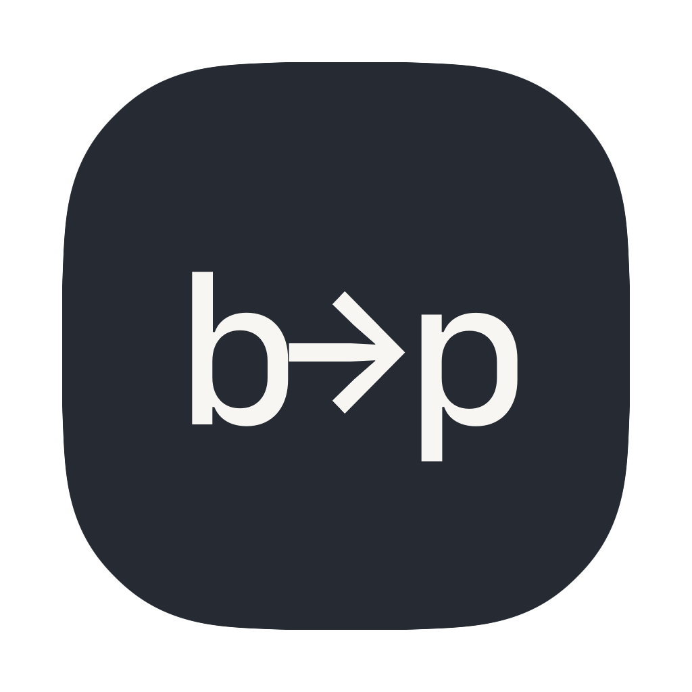
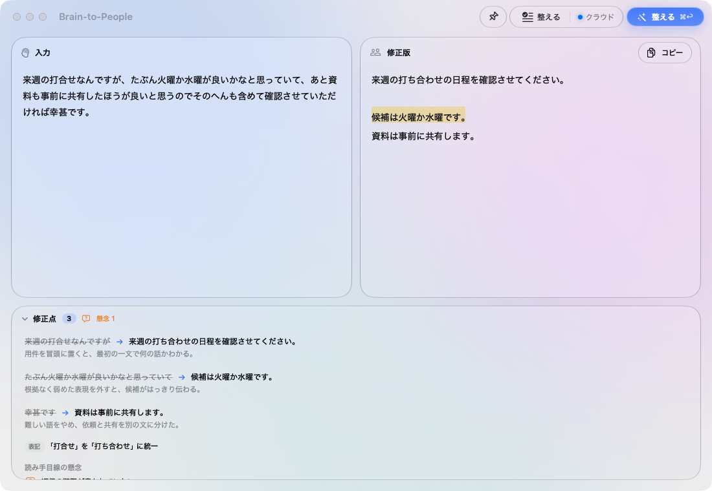
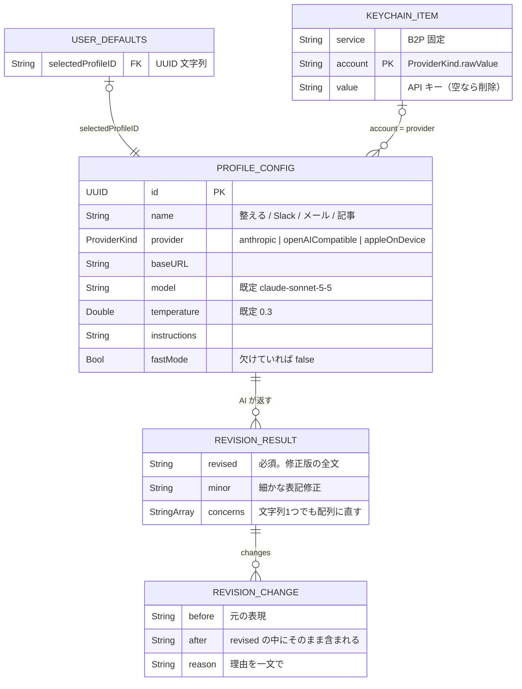
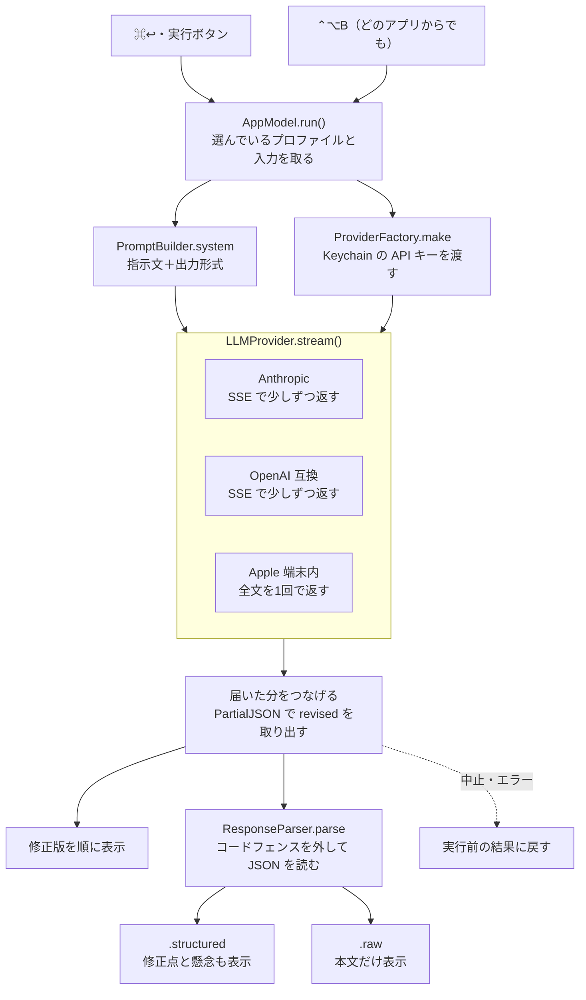

<p align="center"></p>


# Brain-to-People

Brain-to-People（B2P）は、思いついた順に書いた日本語を、読み手が意味を取りやすい文章に直す Mac アプリです。
AI が直した文章と、どこをなぜ直したかを並べて出します。
このアプリは、文章を投稿も送信もしません。
修正版を使うかどうかは、あなたが決めます。

自分で書いた文は、自分には読みやすく見えます。
書いた本人は、言いたいことをもう知っているからです。
読み手が意味を取りにくい箇所は、書いた本人には見つけにくいものです。
B2P は、その箇所を直す前の文、直した後の文、直した理由の組で見せます。



## たとえば、こう動く

左の欄に思いついた順のまま書きます。

> 来週の打合せなんですが、たぶん火曜か水曜が良いかなと思っていて、あと資料も事前に共有したほうが良いと思うのでそのへんも含めて確認させていただければ幸甚です。

`⌘↩` を押すと、右の欄に修正版が出ます。

> 来週の打ち合わせの日程を確認させてください。
>
> 候補は火曜か水曜です。
> 資料は事前に共有します。

下の欄には、直したところが理由とともに1件ずつ出ます。

> 来週の打合せなんですが → 来週の打ち合わせの日程を確認させてください。
> 用件を冒頭に置くと、最初の一文で何の話かわかる。

修正版の中で直した箇所には、薄く色が付きます。
カーソルを重ねると、元の文と理由が出ます。
修正点の行にカーソルを重ねると、修正版の該当部分が濃くなります。
行をクリックすると、その部分を探して示します。
ウィンドウを狭くすると、入力欄と修正版欄を切り替えて使えます。
結果が出たときや修正点を押したときは、修正版の欄を表示します。

書かれていない事実や期限は、足しません。
足りない情報は「確認事項」に出します。
この例なら「返信の期限が書かれていない」です。

修正版の欄は、そのまま書きかえられます。

## いるもの

- macOS 14 Sonoma 以降の Mac
  * 公開中の 1.1 の dmg は、Apple シリコン向けです
- 使う AI。次のどれか1つあれば動きます
  * Anthropic の API キー
  * OpenAI の API キー
  * 鍵のいらない、手元で動く AI（Ollama、LM Studio）
  * Apple Intelligence（macOS 26 以降で、オンにした Mac だけで使えます）

## 始め方

1. [Releases](https://github.com/h4lmirn/brain-to-people/releases) から `Brain-to-People-1.1-arm64.dmg` をダウンロードします
2. dmg を開き、`Brain-to-People` を `Applications` にドラッグします
3. アプリを開きます

初めて開くときは「開けません」と出ます。
このアプリは、Apple の確認（公証）を通していないためです。
次の順に進むと開けます。

1. 出てきた画面で「完了」を押します
2. システム設定 → プライバシーとセキュリティ を開きます
3. 下のほうの「このまま開く」を押し、パスワードを入れます
4. もう一度アプリを開き、「開く」を押します

2回目からは、ふつうに開けます。

開けたら、鍵を入れます。
プロファイルは、直し方の指示文と、送り先の AI の組です。

1. `⌘,` で設定を開きます
2. プロファイル のタブで、使うプロファイルを選びます
3. 「API キー」の欄に鍵を貼りつけます

## 文章の種類で、直し方を変えたいとき

プロファイルを切りかえます。
はじめから、次の5つが入っています。

| プロファイル | 直し方 |
| --- | --- |
| 整える | メモや下書き。段落と見出しで組み立てる |
| Slack | 冒頭1行で用件がわかるようにし、段落を短くする |
| メール | 1行目に件名を付け、結論、背景、お願いの順にする |
| 記事 | 一文ごとに改行し、段落の関係を接続の言葉で示す |
| 整える（Apple Intelligence） | 「整える」と同じ直し方を、Mac の中だけで動かす |

最後の1つは、Apple Intelligence が使える Mac にだけ入ります。

直し方の指示文は、設定で書きかえられます。
AI に返事の形を指定する文は、アプリが指示文の最後に自動で付けます。
指示文を書きかえても、この文は消えません。

プロファイルは JSON に書き出せます。
別の Mac に移すときは、書き出した JSON をその Mac で読み込みます。
鍵は書き出されないので、移した先で入れ直します。

## どの AI に送るかを選ぶ

プロファイルごとに接続方式を1つ選びます。

| 接続方式 | 送り先 | 鍵 |
| --- | --- | --- |
| Anthropic | Anthropic のサーバー | 必ずいる |
| OpenAI 互換 | OpenAI、または手元の Ollama、LM Studio | 手元で動かすなら、なくてもよい |
| Apple Intelligence（端末内） | どこにも送らない。Mac の中で動く | いらない |

画面の右上に、今の送り先が「クラウド」か「ローカル」かが出ます。
Ollama や LM Studio のように、自分の Mac の中で動かすときは「ローカル」です。

はじめのモデルは `claude-sonnet-5-5`（Sonnet 5.5）です。
保存済みの Anthropic の `claude-sonnet-5` も、読み込み時に 5.5 に切り替わります。
書き出した JSON を読み込むときも、同じように切り替わります。
軽く速く済ませたいプロファイルは、`claude-haiku-4-5-20251001` に変えられます。
OpenAI 互換では、設定の「一覧を取得」で、使えるモデルを選べます。

Apple Intelligence は、通信がいらず、お金もかかりません。
ただ、直し方の指示に従う力は、ほかの接続方式より弱めです。
たとえば Slack 向けの指示でも、「ご了承ください」のような、かたい言い回しで返すことがあります。
下書きの整理には十分です。
仕上げには、ほかの接続方式が向いています。

## 外へ送るもの、残すもの

AI に送るものは、次の3つです。

- 入力欄の文章
- プロファイルの指示文（アプリが最後に付ける、返事の形を指定する文を含む）
- 鍵（プロファイルに入れてあるときだけ）

鍵を送るのは、あなたの契約だと送り先に伝えるためです。
送り先は、プロファイルで選んだ接続方式の1か所だけです。
Apple Intelligence なら、どこにも送りません。

Mac の中には、次のものを残します。

| 残すもの | 場所 |
| --- | --- |
| プロファイル | `~/Library/Application Support/B2P/profiles.json` |
| 鍵 | キーチェーン（名前は `B2P`）。接続方式ごとに1つ |
| 入力中の下書き | アプリの設定。次に開いたときも残っています |

AI に送った文章と、AI の返事の履歴は残しません。
入力欄に書きかけの文章だけが、下書きとして残ります。
アプリを閉じると、修正版と修正点は消えます。

## 返事を速くしたいとき

設定のプロファイルで「速さを優先する」をオンにします。
オンにしたプロファイルは、画面右上の名前の横に、黄色い稲妻の印が付きます。

オンにすると、AI が答える前に考える量をいちばん少なくします。
そのぶん、推敲の質が少し下がることがあります。

この設定が反映されるのは、考える量を指定できるモデルだけです。

- 反映される：`claude-sonnet-5-5` や、Opus の各モデル
- 変わらない：`claude-haiku-4-5-20251001`（もともと考える時間をとりません）
- 変わらない：OpenAI 互換と Apple Intelligence

どれだけ速くなったかは、設定の「接続テスト」で見られます。
オンとオフで、出てくる秒数を比べます。

## キーボードでできること

| キー | 動き |
| --- | --- |
| `⌘↩` | 整える（AI に送る） |
| `Esc` | 整えるのを途中で止める |
| `⌃C` または `⌘⇧C` | 修正版をコピーする |
| `⌘1`〜`⌘9` | プロファイルを切りかえる |
| `⌥⌘T` | ウィンドウを常に最前面に出す |
| `⌘,` | 設定を開く |

修正版の全文ではなく、選んだ文字だけをコピーしたいときは、`⌘C` を使います。

## どのアプリからでも呼び出す

Slack やメールで書いた下書きをコピーして、`⌃⌥B` を押します。
Brain-to-People が前に出て、クリップボードの文章が入力欄に入ります。
アプリを開いている間は、どのアプリを使っていても押せます。

`⌘,` →「一般」→「クイック呼び出し」で、次の動きを選べます。

- `⌃⌥B` で呼び出す：はじめはオンです
- 呼び出したとき、クリップボードの文章を入力欄に入れる：はじめはオンです
- 呼び出したら、すぐ整える：はじめはオフです
- 整え終わったら、修正版を自動でコピーする：はじめはオフです

入力欄に文章があったときは、置き換えたあと10秒間、「元に戻す」が出ます。
最後の2つをオンにすると、コピー、`⌃⌥B`、貼りつけの3手で済みます。

## 背景を変える

`⌘,` →「一般」→「背景」で「画像を選ぶ…」を押します。
PNG、JPEG、HEIC、TIFF の画像を選べます。
画像は上から表示し、下へいくほど薄くして背景色に近づけます。
「画像の濃さ」で見え方を調整できます。
「元の背景に戻す」を押すと、はじめの背景に戻ります。

画像は縮小して、この Mac のアプリ用フォルダに保存します。
元の画像を移動しても、再起動後も表示できます。
背景画像を AI に送ることはありません。

### フォルダの画像を順に切り替える

「フォルダを選ぶ…」を押すと、フォルダ内の画像が一定の間隔で切り替わります。
フォルダ直下の PNG、JPEG、HEIC、TIFF が対象です。サブフォルダは見ません。

フォルダを登録すると、次の設定が出ます。

- 切り替え間隔：30秒、1分、5分、30分、1時間から選びます。はじめは5分です
- ランダムな順番にする：オフならファイル名順に進み、最後まで来たら先頭に戻ります
- 次の画像へ：すぐ次の画像に切り替えます。順番は上の設定に従います
- シャッフル：今の画像以外から、ランダムに1枚選んで切り替えます。上の設定がオフでも使えます
- フォルダの登録を解除：登録をやめます。以前に選んだ1枚の背景があれば、その画像に戻ります

切り替わるのは、アプリを開いている間です。
切り替えのたびにフォルダの中身を読み直すので、画像を足したり消したりしても反映されます。
読めない画像は飛ばします。
登録したフォルダは、再起動後も引き継ぎます。
フォルダ内の画像は縮小して表示するだけで、コピーは作りません。

フォルダを登録している間は、そちらが1枚の背景より優先されます。
「画像を選ぶ…」で1枚を選ぶと、フォルダの登録は解除されます。
「元の背景に戻す」は、フォルダの登録も1枚の背景も消します。

入力欄、修正版欄、修正点の欄は、背後がぼけて透ける、すりガラス風のパネルです。

`⌘,` →「一般」→「テキストボックス」で「背景の透明度」を変えられます。
入力欄と修正版欄に共通の設定です。
値を上げると、文字の濃さを保ったまま背後の画像が見えやすくなります。
0〜100% を5%ずつ調整でき、初期値は 0% です。
0% では、背後の画像がいちばん見えにくくなります。
100% で欄の背景が透明になります。
設定は再起動後も残ります。
この設定では、修正点の欄の背景は変わりません。

## できないこと、うまく動かないとき

- 60秒たっても返事がないときは、止めてエラーを出します
  * 入力欄の文章は消しません
- AI の返事が決まった形になっていないときは、返事をそのまま修正版の欄に出します
  * そのとき、修正点の欄には「修正点を読み取れませんでした」と出ます
- 長い文章では、修正版が途中で切れることがあります
  * 一度に返せる長さに上限があるためです
  * 上限は4096トークン（AI が文字を数える単位）です
  * 切れたときは、文章を分けて、それぞれに `⌘↩` を押してください
- 修正版は、AI が書くのに合わせて少しずつ出ます
  * 修正点と確認事項は、書き終わってからまとめて出ます
  * 最初の文字が届くまでは、待った秒数が出ます
  * 途中で止めたときや、エラーになったときは、前の結果に戻ります
  * Apple Intelligence は、全部そろってから一度に出ます
- 前の入力と返事の記録（履歴）はありません

鍵が違うと、「認証に失敗しました」と出ます。
設定で、鍵を入れ直してください。
Ollama や LM Studio につながらないときは、先にそのアプリを動かしておきます。

## ソースから作りたいとき

Xcode か、Xcode の Command Line Tools を入れておきます。
Xcode があると、Intel と Apple シリコンの両方で動く形で作れます。

```
git clone https://github.com/h4lmirn/brain-to-people.git
cd brain-to-people
scripts/build-app.sh --install
```

`--install` を付けると、`~/Applications` に入れます。
`--dmg` を付けると、配る用の dmg を `dist/` に作ります。

テストは次のコマンドで動かします。

```
swift test
```

Apple Intelligence を実際に呼ぶテストは、ふだんは動きません。
10秒ほどかかるためです。
動かすときは、次のようにします。

```
B2P_ONDEVICE=1 swift test --filter AppleOnDeviceTests
```

SwiftPM が環境の不整合で起動しないときは、対応する SDK を指定して直接ビルドできます。
たとえば Swift 6.1.2 と macOS 15.5 SDK がある環境では、次を使います。

```
B2P_DIRECT_SDK=/Library/Developer/CommandLineTools/SDKs/MacOSX15.5.sdk bash scripts/build-app.sh
```

アプリは `build/Brain-to-People.app` にできます。
この方法では、ビルドした Mac の種類向けだけに作ります。
macOS 15.5 SDK で作った版では、Apple Intelligence は使えません。

中のしくみは、次の2つに分かれています。

- `Sources/B2PCore`：AI への送り方、返事の読み取り、保存。画面を持ちません
- `Sources/B2P`：画面とキーボード操作

### データの形

保存するものは3か所に分かれています。

- プロファイル：`~/Library/Application Support/B2P/profiles.json`
- API キー：Keychain。接続方式ごとに1件です
- 選んでいるプロファイル：UserDefaults

AI の返事は、`RevisionResult` の形の JSON として読みます。
必ずいるのは `revised` だけです。



### 実行の流れ

修正版は、届いたところまで順に画面に出します。
修正点と懸念は、全文が届いてからまとめて出します。
中止したときやエラーのときは、実行前の結果に戻します。



アイコンと README 用の画像は、`bash scripts/make-icon.sh` で作り直せます。

## 使ってよい人

MIT ライセンスです。
だれでも、使う、書きかえる、配ることができます。
くわしくは [LICENSE](LICENSE) を見てください。
